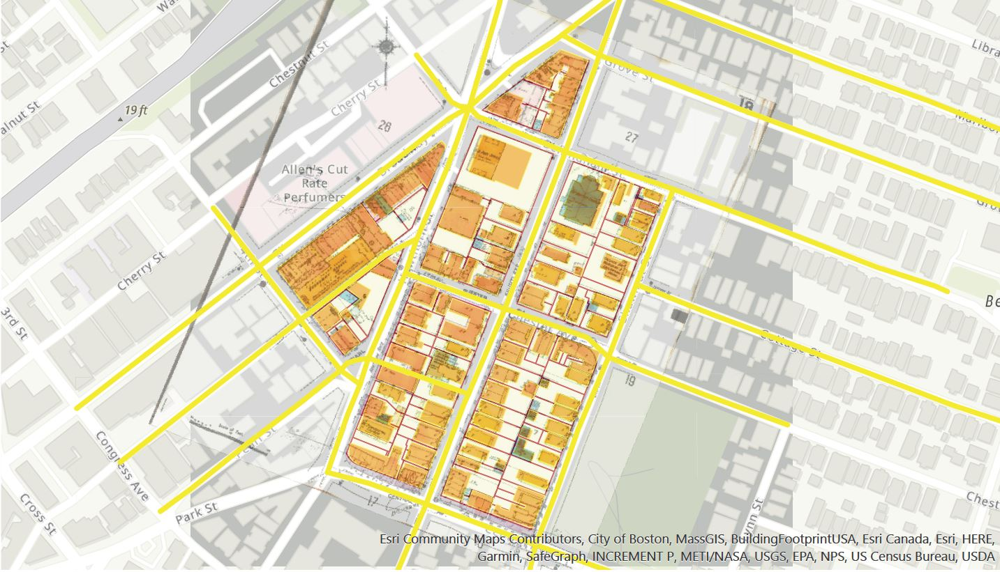

```{r setup, include=FALSE}
knitr::opts_chunk$set(echo = TRUE)
```

The portfolio demonstrates the skills on visualizing and analyzing data using R studio and ArcGis that I learnt in the span of six weeks of Spatial Analysis course. My most important learning came through written and video tutorials from Prof. Voulgaris, group works and the hours I spent in trials-and-errors. Like any other language, R-studio requires consistent practice. So, I hope to continue exploring and learning the language in the days to come. 

# Assignment 1 Displaying Data
The objective of the first assignment was to learn how to visualize plotting multiple layers of point and line data on a map. We worked together as a group exploring Chicago's access to public transportation through transit systems.

[]

I learnt that a strong visualization includes employing cohesive but simple color schemes, using transparency to create a clear visual hierarchy, experimenting with point size to reduce clutter while emphasizing the key data, and prioritizing what we want to communicate using contracting colors between base map and layering data.

# Assignment 2 Visualizing Places

Our group of three began with an interest in the impact of two significant fires on the city of Chelsea, Massachusetts. In our research with the maps librarians, we encountered Sanborn Maps and the detailed accounting that came about with the expansion of property insurance beginning in the late 1800s.The basemap is a historic map from 1935.
[]

I learnt the skill of geo-referencing and playing with the color scheme, line thickness, layering polygon and line data on ArcGis. Apart from that, this assignment ignited my interest in old maps and map study in general. Turns out, maps are really cool! 

# Assignment 3 Spatial Relationships
In the third assignment we analysed relationships between public schools, hospitals where I learnt to "quantify relationships among locations that can be described as points and polygons on a map and to create a map showing relationships between points and polygons using buffers and spatial joins".

[](https://shrinkhala1.github.io/Portfolio/fullsize/hospital - Copy.pdf){target="_blank"}

On average, a Boston Hospital is 532 meters from a Public School:

[](https://shrinkhala1.github.io/Portfolio/fullsize/hospsch11 - Copy.pdf){target="_blank"}


# Assignment 4&5 Networks and Rasters
We chose Jiaxing, China for this assignment. Jiaxing is understudied in comparison to many Western cities, so we downloaded our data using conversion software that helped us to acquire data in '.pbf' format - thanks to Prof. Vulgaris for the help on this!
Here, I have created isochrones to map transit travel times to the nearest school in Jiaxing. 

[](https://shrinkhala1.github.io/Portfolio/fullsize/final45 - Copy.pdf){target="_blank"}


This was one of the most rewarding assignments for me as I learnt a valuable skill of analyzing accessibility and creating isochrones; a skill that I can see myself using in analyzing motorized and non-motorized transportation statistics in Kathmandu in the future.

# Assignment 6 Interactive Maps
For the final assignment, we did a interesting reading Retchless on how . 

For this individual assignment, I chose to visualize an interactive map showing the total percentage of Male under 5 who identify as Asian alone in Suffolk County, Massachussets.  

[](https://shrinkhala1.github.io/Portfolio/fullsize/Asian_Male_under5.html){target="_blank"}

In today's digital age we have a tremendous opportunity to use web-based interactive maps to ignite public interest in urban planning and design by allowing a user autonomy in how data is displayed which can contribute to the persuasive power of a map or figure.


